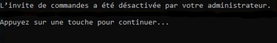

# Guide : Interdire l'utilisation de l'invite de commande via GPO

## Prérequis
- Un serveur Windows avec Active Directory installé.
- Un accès administrateur au serveur.
- Un client Windows joint au domaine pour tester la GPO.

## 1. Ouvrir la Console de Gestion des Stratégies de Groupe (GPMC)
1. Se connecter au serveur Active Directory.
2. Ouvrir **Exécuter** (`Win + R`), taper `gpmc.msc`, et valider.
3. Dans **Gestion des stratégies de groupe**, naviguer jusqu’au domaine ou l’OU contenant les utilisateurs concernés.

## 2. Créer une Nouvelle GPO
1. Clic droit sur l'OU cible (**Utilisateurs** ou **Ordinateurs**) et sélectionner **Créer un objet GPO dans ce domaine, et le lier ici**.
2. Nommer la GPO : `Utilisateur_Bloquer_Invite de Commande`.
3. Clic droit sur la GPO et sélectionner **Modifier**.

### Bonnes Pratiques de Nommage des GPO
- Utiliser un préfixe pour distinguer les GPO utilisateur (`Utilisateur_`) et ordinateur (`Ordinateur_`).
- Définir un nom clair et explicite reflétant l'objectif de la GPO.
- Éviter les espaces et préférer les underscores (`_`) pour la lisibilité.
- Ajouter un suffixe si nécessaire pour identifier des versions ou des tests (`_V1`, `_Test`).

## 3. Configurer la Restriction de l'Invite de Commande
1. Dans l'éditeur de stratégie de groupe, aller à :
   ```
   Configuration utilisateur > Stratégies > Modèles d'administration > Système
   ```
2. Trouver la stratégie **Empêcher l'accès à l'invite de commandes**.
3. Double-cliquer dessus, sélectionner **Activé**.
4. (Facultatif) Pour empêcher aussi l'exécution des scripts batch (`.bat`), cocher **Désactiver également l’exécution des scripts CMD**.
5. Appliquer et valider en cliquant sur **OK**.

### Lier et créer des OU dans Active Directory
1. Ouvrir **Utilisateurs et Ordinateurs Active Directory** (`dsa.msc`).
2. Clic droit sur le domaine > **Nouveau** > **Unité d'organisation**.
3. Nommer l'OU (ex. `Personnels` ou `Employés`) et valider.
4. Déplacer les utilisateurs concernés dans cette OU.
5. Lier la GPO à cette OU en revenant dans **GPMC**, clic droit sur l'OU > **Lier un objet de stratégie de groupe existant**.
6. Sélectionner la GPO `Utilisateur_Bloquer_Invite de Commande` et valider.

## 4. Appliquer et Tester la GPO
1. Fermer l’éditeur de stratégies de groupe.
2. Forcer l'application de la stratégie avec la commande :
   ```powershell
   gpupdate /force
   ```
3. Tester sur un poste client en tentant d'ouvrir l'invite de commande (`cmd.exe`).
4. Si la stratégie est bien appliquée, un message s'affichera indiquant que l'accès est interdit.




## 5. Vérification et Dépannage
- Vérifier que l’utilisateur est bien dans l’OU où la GPO est appliquée.
- Utiliser `gpresult /r` sur un client pour voir les GPO appliquées.
- Assurer que la GPO est bien activée et correctement configurée.

## 6. Liens Utiles
- Documentation Microsoft GPO : [Microsoft Docs](https://docs.microsoft.com/en-us/windows-server/)
- Stratégies de groupe avancées : [GPO Guide](https://docs.microsoft.com/en-us/windows-server/identity/ad-ds/manage/component-updates/gpo-management)

